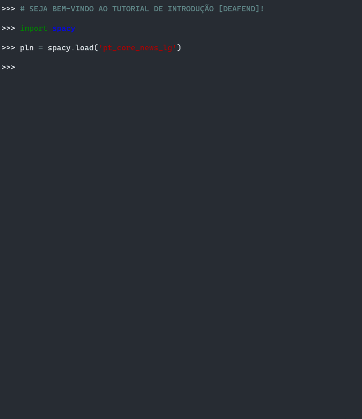
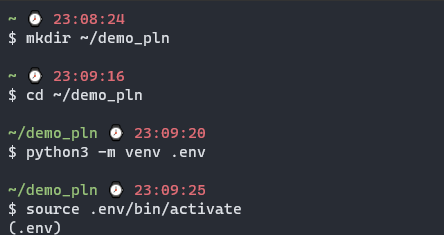
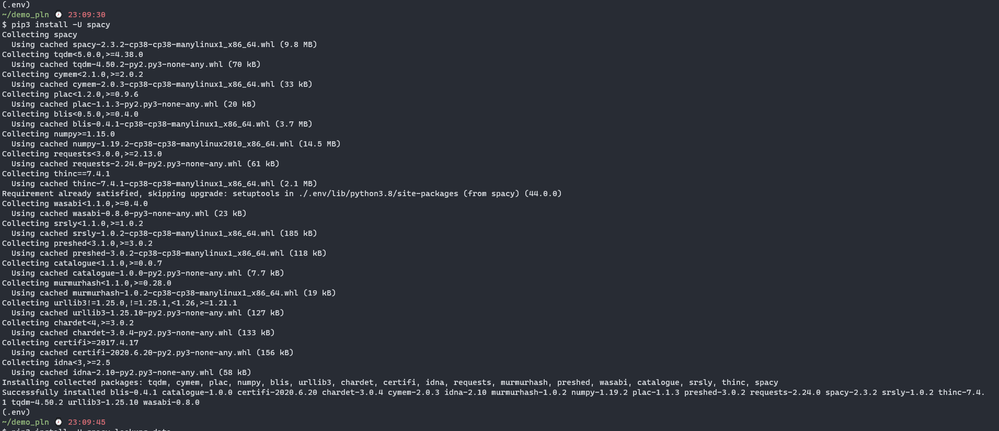
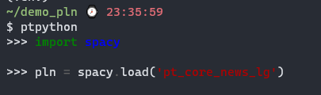
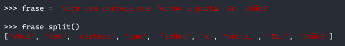
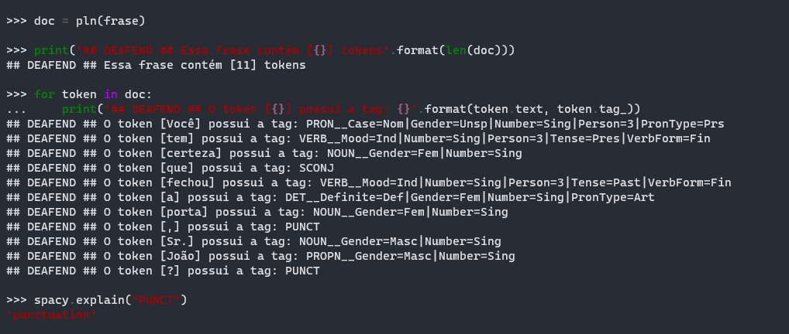
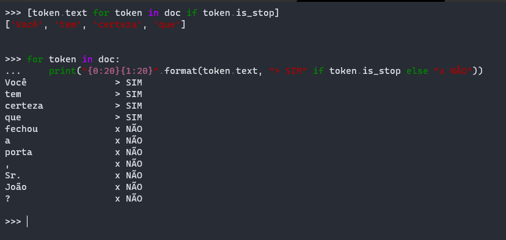
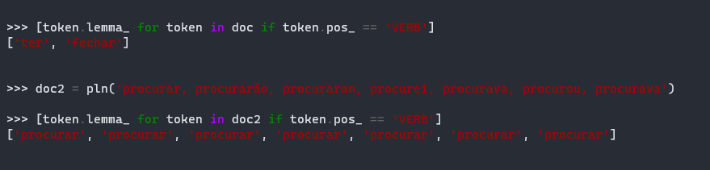
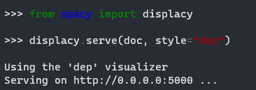
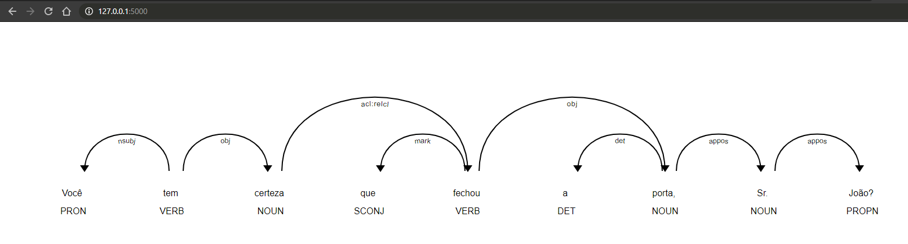

# Introdução: Processamento de Linguagem Natural (PLN)

<figure>
  
  <figcaption>
    <span align="center"><blockquote>Fonte da imagem: https://ubots.com.br/blog/processamento-de-linguagem-natural/</blockquote></span>
  </figcaption>
</figure>

---

<p align="center">
  
  
  
  
</p>

<p align="center">
  <a href="#wrench-configuração">Configuração</a>&nbsp;&nbsp;&nbsp;|&nbsp;&nbsp;&nbsp;
  <a href="#boom-demonstração">Demonstração</a>&nbsp;&nbsp;&nbsp;|&nbsp;&nbsp;&nbsp;
  <a href="#books-tecnologias">Tecnologias</a>&nbsp;&nbsp;&nbsp;|&nbsp;&nbsp;&nbsp;
  <a href="#microscope-futuro">Futuro</a>
</p>

<p align="center">
  
</p>

## :wrench: Configuração

> :warning: **AVISO:** as configurações e comandos exibidos neste tutorial consideram a utilização de um sistema operacional Linux. Porém, caso você esteja no Windows ou no macOS, as mudanças não são tão grandes e você precisa apenas certificar-se de que possui em seu dispositivo: [GIT](https://git-scm.com/) e [Python](https://www.python.org/).

```shell
# Atualizando os pacotes para garantir que estamos trabalhando na última versão de cada um
sudo apt update

# Instalar dependências a nível de Sistema Operacional com apt-get
sudo apt-get install build-essential python3 git
```

### Pip e Venv

- [Pip](https://pypi.org/project/pip/): é o instalador de pacotes Python que iremos utilizar para instalar bibliotecas de terceiros que serão usadas nesta demonstração.
- [Venv](https://docs.python.org/3/library/venv.html): possibilita que criemos um "ambiente virtual" para cada projeto Python que estivermos trabalhando, o que previne o conflito entre versões dos mesmos pacotes entre diretórios diferentes e também impede que modifiquemos esses pacotes no contexto "global" do sistema. Por fim, essa prática ainda nos permite criar o arquivo `requirements.txt` (veremos adiante) para deixar claro os pacotes que usamos.

```shell
# Instalar pip e venv para gerenciar os pacotes instalados exclusivamente neste projeto
sudo apt install python3-venv python3-pip

# Confirme a versão de todos pacotes instalados
python3 --version # Python 3.8.2
pip3 --version    # pip 20.0.2 from /usr/lib/python3/dist-packages/pip (python 3.8)
```

### Projeto

Agora iremos criar um diretório e, dentro dele, iremos instanciar nosso ambiente virtual, instalar nossos pacotes e fazer alguns testes.

<p align="center">
  
</p>

```shell
# Crie um diretório onde preferir, por exemplo:
mkdir ~/demo_pln

# Entre no diretório
cd ~/demo_pln

# Crie um novo ambiente virtual com venv
python3 -m venv .env

# Inicie o ambiente virtual criado
source .env/bin/activate

# Instale o ptpython para que o terminal apresente utilidades como autocomplete e highlight (vai ficar igual aos screenshots abaixo :D)
pip3 install ptpython
```

### Spacy

[Spacy](https://spacy.io/) é a biblioteca de Processamento de Linguagem Natural (PLN, ou Natural Language Processing - NLP) escolhida para utilizarmos nessa demonstração (e no próprio DEAFEND). Sua escolhe deve-se ao fato dela possuir três modelos neurais, em Português, extremamente robustos (o maior tem 549 MB e é o que vamos usar!).

> :bulb: **DICA:** se deseja se aprofundar mais na biblioteca, veja [este curso](https://course.spacy.io/en/).

<p align="center">
  
</p>

```shell
# Instale o spacy core
pip3 install -U spacy

# Instale a tabela de dados adicional para a lematização
pip3 install -U spacy-lookups-data

# Faça download do modelo neural - aqui iremos utilizar o maior dos três para termos a melhor acurácia possível (~95.02% para Part-of-Speech, por exemplo)
python3 -m spacy download pt_core_news_lg
```

#### Para saber mais

A biblioteca Spacy possui alguns termos essenciais que devem ser esclarecidos antes de seguirmos para facilitar sua compreensão. Vamos a eles:

- [Doc](https://spacy.io/api/doc): é uma sequência de _Tokens_ e, nessa sequência (_array_), contém diversas propriedades referentes ao texto com o qual ele foi criado.
- [Token](https://spacy.io/api/token): é uma parte de uma expressão e, dependendo do formato com a qual a expressão foi criada, pode ser uma palavra, um símbolo de pontuação, um espaço em branco ou uma frase completa. Nos cenários que serão abordados nesta introdução, iremos tokenizar _frases_ e, por isso, os tokens serão _palavras_ e _pontuações_.

## :boom: Demonstração

> Nesta seção, algumas funcionalidades linguísticas do Spacy serão demonstradas com a intenção de explanar as grandes oportunidades disponíveis em poucos comandos.

<p align="center">
  
</p>

Antes de mais nada, execute este comando, pois ele irá utilizar o modelo em Português que acabar de baixar e será útil durante todos os testes. Abra seu terminal e rode:

```shell
# Irá abrir o interpretador Python que adicionamos no começo do tutorial
ptpython
```

```python
# Importe a biblioteca Spacy para o script
import spacy

# Iremos instanciar uma variável que irá carregar o modelo que baixamos anteriormente
pln = spacy.load('pt_core_news_lg')
```

### Tokenização

A _feature_ mais conhecida ao trabalhar com textos é a [tokenização](http://nltk.sourceforge.net/doc/pt-br/tokenize.html). De forma resumida, é a tarefa de dividir o texto selecionado em partes significativas (conhecidas como _tokens_).

Porém, se fosse apenas dividir o texto, por que não usar apenas um método [split](https://www.w3schools.com/python/ref_string_split.asp), por exemplo? Vamos tentar!

<p align="center">
  
</p>

```python
# Vamos criar uma variável com a frase que utilizaremos em nossos testes
frase = 'Você tem certeza que fechou a porta, Sr. João?'

# Agora, vamos ver qual é a saída obtida ao aplicar o método split
frase.split()
```

> :star: **NOTA:** é possível notar que, em um primeiro momento, a divisão parece adequada. O método split manteve corretamente _"Sr."_ como um único elemento, já que ele é uma abreviação da expressão _"Senhor"_. Porém, perceba que _"porta,"_ e _"João?"_ também foram agrupados como um único elemento, mas não necessariamente fazem parte da mesma expressão.

<p align="center">
  
</p>

```python
# Vamos criar uma variável com uma instância Doc utilizando a frase que definimos anteriormente
doc = pln(frase)

# Vamos analisar quantos tokens tem nossa frase de exemplo
print('## DEAFEND ## Essa frase contém [{}] tokens'.format(len(doc)))

# Agora vamos iterar sobre todos os tokens e verificar qual é a tag de cada um deles
for token in doc:
  print('## DEAFEND ## O token [{}] possui a tag: {}'.format(token.text, token.tag_))

# Dica: se desejar entender melhor o que é TAG, pegue a TAG respectiva de um dos tokens e execute o comando abaixo, que fornecerá uma breve descrição do seu significado
spacy.explain("PUNCT")
```

> :star: **NOTA:** perceba como a biblioteca é inteligente o suficiente para identificar que as palavras _"porta"_ e _"João"_ devem ser tratadas como tokens independentes das pontuações que as acompanham e, por isso, cria um elemento para cada, classificando-os corretamente como "PUNCT". Contudo, mantém o ponto final (.) junto da expressão _"Sr"_, assim como o split.

### Stopwords

Este termo indica palavras que compõe o que é chamado de ["stop list"](https://en.wikipedia.org/wiki/Stop_word), que nada mais é do que um conjunto de palavras que são frequentemente utilizadas nas frases da língua, mas que não agregam nenhum valor sintático ou semântico para a análise das expressões. Sendo assim, para aumentar a acurácia das operações e facilitar o processamento, essas palavras costumam ser removidas.

> :bulb: **DICA:** não há uma regra específica para classificar uma palavra como "stopword", mas é consenso de que palavras de áreas muito específicas ou raras não serão stopwords úteis. Além disso, você pode adicionar ou remover palavras da lista _default_ fornecida pelo Spacy.

<p align="center">
  
</p>

```python
# Ainda utilizando nossa frase de exemplo, vamos printar apenas as palavras consideradas como STOPWORD pelo Spacy
[token.text for token in doc if token.is_stop]

# Agora, vamos lembrar quais são nossos tokens e quais NÃO são stopwords
for token in doc:
  print("{0:20}{1:20}".format(token.text, "> SIM" if token.is_stop else "x NÃO"))
```

### Lematização

Confesso que a lematização (saiba mais [aqui](http://www.nilc.icmc.usp.br/nilc/download/lematizacao_versus_steming.pdf) e [aqui](https://portuguese.stackexchange.com/questions/1417/o-que-%C3%A9-lematiza%C3%A7%C3%A3o)) é a funcionalidade do Processamento de Linguagem Natural que mais chama minha atenção, uma vez que a biblioteca precisa ser treinada o suficiente para reconhecer flexibilizações das palavras quanto ao seu gênero, grau, tempo e número, por exemplo. Por isso, vamos fazer alguns testes agora!

<p align="center">
  
</p>

```python
# Vamos printar o lemma dos verbos da nossa frase de exemplo, que são: ["tem" e "fechou"]
[token.lemma_ for token in doc if token.pos_ == 'VERB']

# Agora vamos fazer um exercício mais completo e colocar SETE variantes da mesma palavra ["procurar"]
doc2 = pln('procurar, procurarão, procuraram, procurei, procurava, procurou, procurava')
[token.lemma_ for token in doc2 if token.pos_ == 'VERB']
```

### Visualizando as dependências de nosso Doc

Por fim, uma ferramenta incrível que o Spacy possui embutida é poder ver gráficos que expressam as ligações entre as palavras de um Doc. Vamos visualizar utilizando nossa frase de exemplo:

<p align="center">
  
</p>

```python
from spacy import displacy
displacy.serve(doc, style="dep")
```

Logo após fazer isso, abra seu browser [neste endereço](http://127.0.0.1:5000/). Se tudo correu bem, você deverá ver uma imagem idêntica à esta:

<p align="center">
  
</p>

> :bulb: **DICA:** você pode customizar as cores e o estilo do gráfico. [Veja as opções disponíveis aqui](https://spacy.io/api/top-level#displacy_options).

## :books: Tecnologias

- [Python](https://www.python.org/)
- [PIP](https://pypi.org/project/pip/)
- [Venv](https://docs.python.org/3/library/venv.html)
- [Spacy](https://spacy.io/)
- [displaCy](https://explosion.ai/demos/displacy)
- [ptpython](https://github.com/prompt-toolkit/ptpython)
- [GIT](https://git-scm.com/)
- [ScreenToGif](https://www.screentogif.com/)
- [HTML](https://developer.mozilla.org/pt-BR/docs/Web/HTML)

## :microscope: Futuro

> Eu espero, sinceramente, que você tenha gostado dessa pequena introdução ao mundo do PLN! A partir de agora, é com você - existe muito tutorial e artigo bom pra seguir. Além disso, eu deixei abaixo alguns conteúdos que li para embasar este repositório e o endereço dos dois repositórios do meu Trabalho de Conclusão de Curso (que foi a origem disso tudo).

- :iphone: [Aplicativo](https://github.com/joao-vieira/deafend): o aplicativo resultado de todo estudo realizado.
- :snake: [API REST](https://github.com/joao-vieira/deafend-server): responsável por utilizar o Spacy e receber as chamadas realizadas pelo aplicativo, retornando os textos já processados.

### Referências

- [Spacy - Funcionalidades de Linguística](https://spacy.io/usage/linguistic-features)
- [NLTK Essentials - Livro](https://www.amazon.com.br/dp/B012T6HHPI/ref=dp-kindle-redirect?_encoding=UTF8&btkr=1)
- [Brincando de Processamento Natural de Linguagem com spaCy](https://leportella.com/pt-br/npl-com-spacy/)
- [Turing Talks](https://medium.com/turing-talks)
- [Conjugação - Verbo Procurar](https://www.conjugacao.com.br/verbo-procurar/)

<p align="center">Feito com :dart: por <a href="https://www.linkedin.com/in/jo%C3%A3o-vitor-veronese-vieira/" target="_blank" rel="noopener noreferrer">João Vitor Veronese Vieira</a> :boy:</p>
